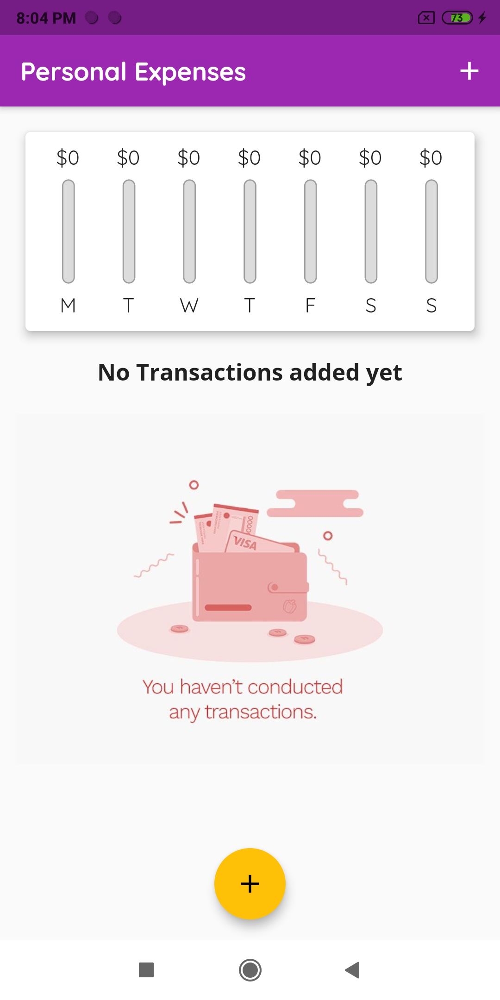
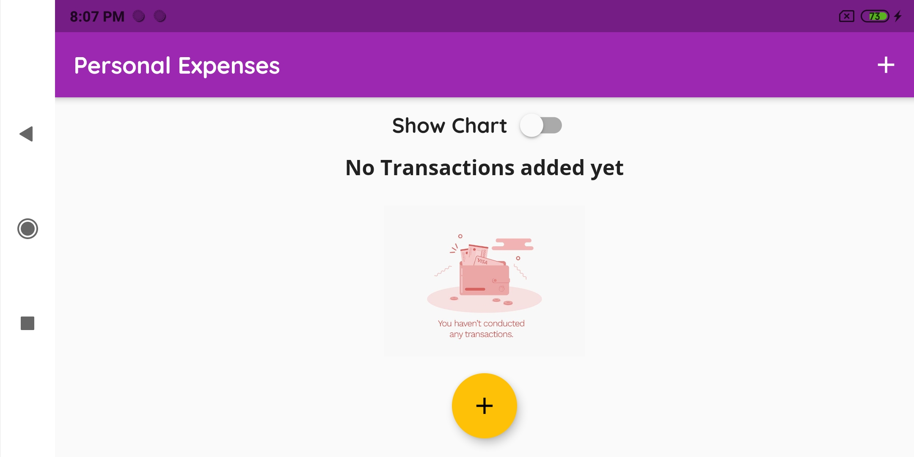
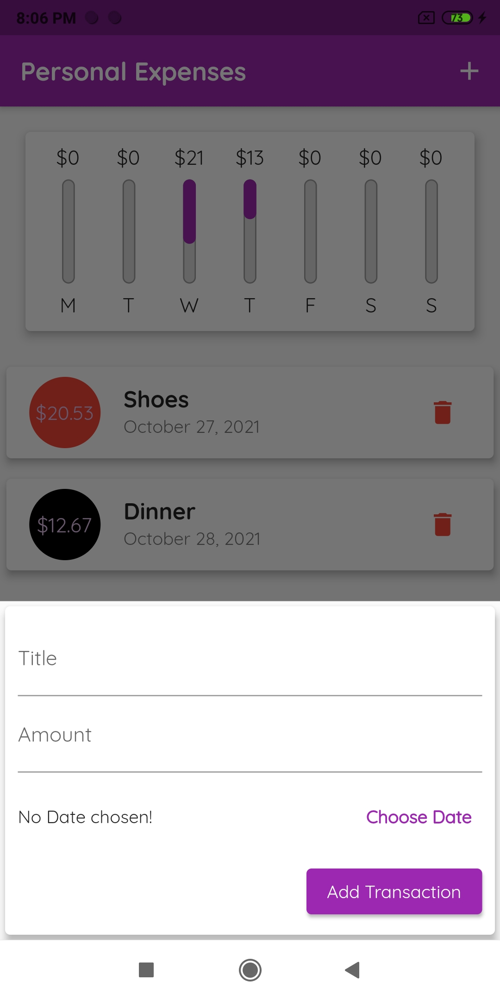
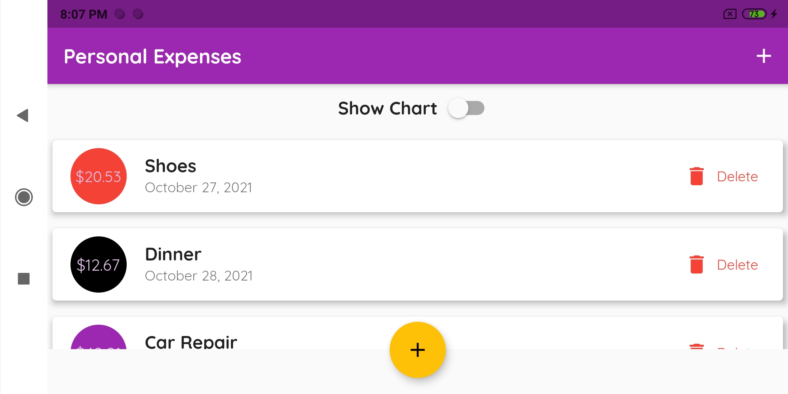
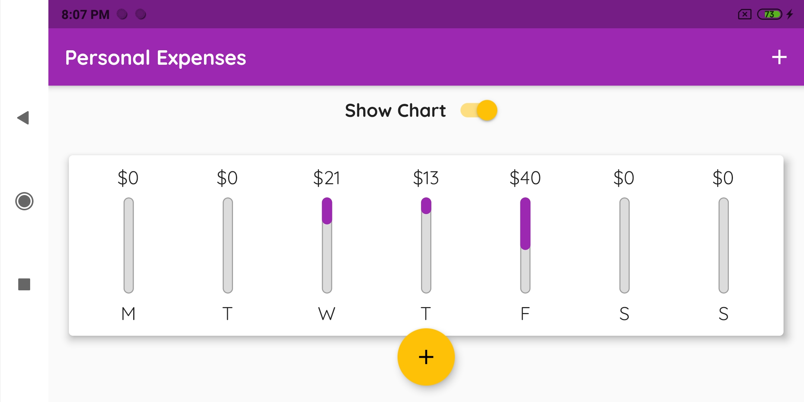

# Personal Expenses App

This is a Personal expenses app, which I am designing to explore the layout widgets of flutter and also learn some new widgets like Card and adding charts to apps.
I will be adding a chart to display the amount spent in the last 7 days, and also to have the list to show all expenses done
I will also be adding a delete option using Icon widget to delete a particular record. 

## UI of the Application

**1. Initial State**

   </t>
  

 

**2. Expenses List**
 

* Potrait:

 

* Landscape:

 

